# My Favorite Places : Clusterisation de conteneurs

Projet du module **Clusterisation de conteneurs** (ESGI Lyon, 5ESGI AL + IABD).
<br/>L'objectif est de conteneuriser, orchestrer puis gérer la montée en charge de l'application **My Favorite Places** (un client React et une API Node.js/Express qui stocke ses données dans PostgreSQL).

Ce README documente **toute la démarche, étape par étape**. 
<br/>Chaque nouvelle étape du module ajoute une section à la suite.

## Sommaire

1. [Test initial avec Bruno](#1-test-initial-avec-bruno)
2. [Dockerisation du serveur](#2-dockerisation-du-serveur)
3. [Dockerisation du client](#3-dockerisation-du-client)
4. [Orchestration avec Docker Compose](#4-orchestration-avec-docker-compose)
5. [Communication entre les services](#5-communication-entre-les-services)
6. [Démarrage, redémarrage et images légères](#6-démarrage-redémarrage-et-images-légères)

## Structure du dépôt

```
.
├── client/                          # application React (Vite)
├── server/                          # API Node.js / Express / TypeORM
├── compose.yml                      # lance la base, le serveur et le client ensemble
├── mfp-bruno-api-test-collection/   # collection Bruno pour tester l'API
└── screenshots/                     # captures d'écran des tests
```

## Environnement de travail

| Outil | Version | Remarque |
|---|---|---|
| Docker Engine | 29.7.2 | installé dans WSL2 (Ubuntu 24.04), sans Docker Desktop |
| Docker Compose | v5.5.0 | plugin `docker compose` |
| Node.js / Yarn | 22.23.2 / 1.22.22 | installés dans WSL via nvm |
| Bruno | 4.2.1 | client API installé sous Windows |

Toutes les commandes sont lancées depuis un terminal **WSL (Ubuntu)**, à la racine du dépôt.

# TD1
---

## 1. Test initial avec Bruno

**Objectif (TD1, étape 1) :** prendre en main le projet, lancer l'API en local avec `yarn dev` et vérifier qu'elle répond, avant toute dockerisation.

### 1.1 Prérequis : lancer d'abord une base PostgreSQL

Le serveur ne démarre **que s'il arrive à se connecter à PostgreSQL**. 
<br/>Sans base, le serveur affiche `🚨 unable to connect to db` et n'écoute jamais sur le port 3000.

Les paramètres de connexion sont écrits en dur dans `server/src/datasource.ts` :

| Paramètre | Valeur |
|---|---|
| host | `localhost` |
| port | `5432` (port par défaut) |
| username | `postgres` |
| password | `supersecret` |
| database | `postgres` |

L'option `synchronize: true` de TypeORM crée automatiquement les tables `user` et `address` au démarrage.
<br/>Il suffit donc de fournir une base PostgreSQL vide.

On lance une base PostgreSQL dans un conteneur Docker, avec ces identifiants :

```bash
docker run -d --name mfp-db \
  -e POSTGRES_PASSWORD=supersecret \
  -p 5432:5432 \
  postgres:17
```

- `-e POSTGRES_PASSWORD=supersecret` : mot de passe de l'utilisateur `postgres`, identique à celui attendu par le serveur.
- `-p 5432:5432` : expose le port de la base sur `localhost`, pour que le serveur (lancé hors Docker) puisse la joindre.

On vérifie avec `docker ps` que le conteneur `mfp-db` est bien démarré (statut `Up`, port `5432` exposé) :

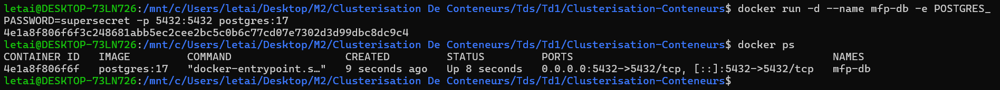

### 1.2 Lancer l'API en mode développement

```bash
cd server
yarn install
yarn dev
```

`yarn dev` lance `nodemon src/index.ts`
<br/>Le démarrage est réussi lorsque la console affiche :

```
✅ connected to PgSQL db
🚀 server started on port 3000
```

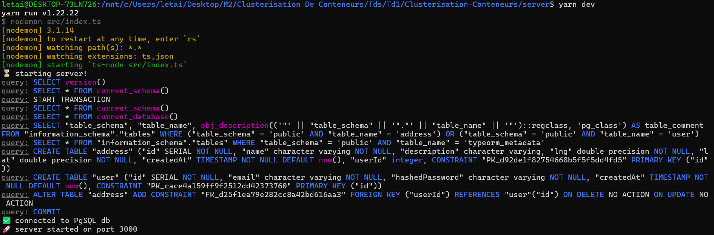

### 1.3 Routes de l'API

Toutes les routes sont préfixées par `/api` et l'API écoute sur `http://localhost:3000`.

| Méthode | Route | Authentification | Rôle |
|---|---|---|---|
| POST | `/api/users` | non | créer un utilisateur (`email`, `password`) |
| POST | `/api/users/tokens` | non | se connecter et obtenir un JWT |
| GET | `/api/users/me` | oui | profil de l'utilisateur connecté |
| POST | `/api/addresses` | oui | ajouter une adresse |
| GET | `/api/addresses` | oui | lister ses adresses |
| POST | `/api/addresses/searches` | oui | rechercher ses adresses dans un rayon (en km) autour d'un point |

L'authentification se fait avec le header `Authorization: Bearer <token>`. 

### 1.4 Collection Bruno

La collection est versionnée dans `mfp-bruno-api-test-collection/` (ouvrir ce dossier dans Bruno). 
Elle contient 3 requêtes, à exécuter dans l'ordre :

| # | Requête | Résultat attendu |
|---|---|---|
| 01 | Create user | `200`, l'utilisateur créé |
| 02 | Login (get token) | `200`, `{ "token": "..." }` |
| 03 | My profile | `200`, l'utilisateur connecté |

Utilisateur de test : **ahmed test 1**, email `ahmedtest@gmail.com`, mot de passe `azerty123`.

### 1.5 Résultats des tests

#### 01 — Créer un utilisateur

`POST http://localhost:3000/api/users`

```json
{
  "email": "ahmedtest@gmail.com",
  "password": "azerty123"
}
```

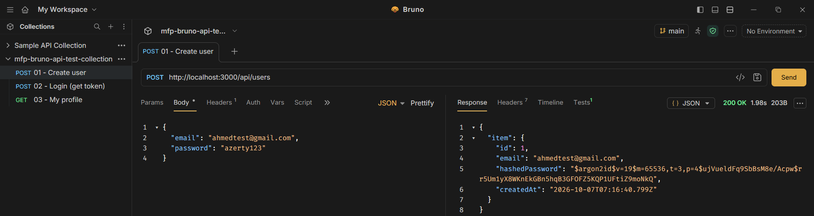

#### 02 — Se connecter (obtenir un token)

`POST http://localhost:3000/api/users/tokens` (même corps que la requête 01)

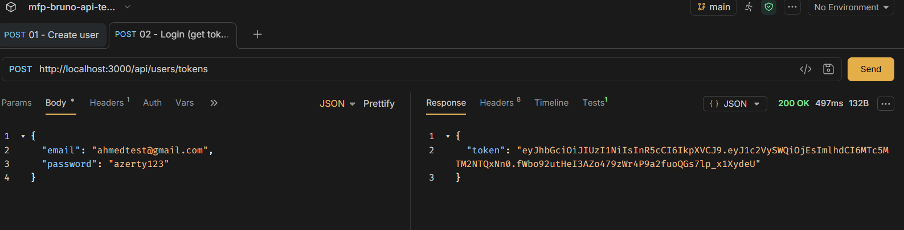

#### 03 — Mon profil

`GET http://localhost:3000/api/users/me` (header `Authorization: Bearer {{token}}`)

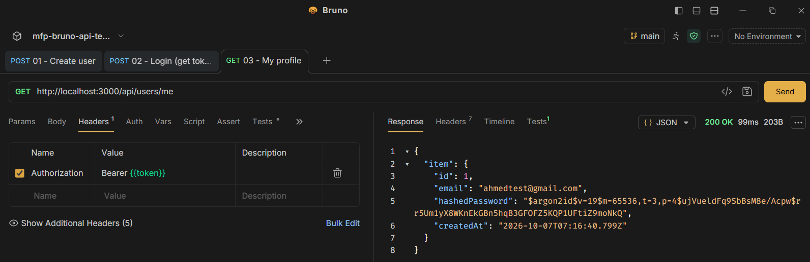

---

## 2. Dockerisation du serveur

**Objectif (TD1, étape 2) :** faire tourner l'API dans un conteneur Docker, à côté de la base, et la tester à nouveau avec Bruno.

### 2.1 Le Dockerfile du serveur

Fichier `server/Dockerfile` :

```dockerfile
FROM node:24-alpine3.24

WORKDIR /app

COPY package.json yarn.lock ./
RUN yarn install --frozen-lockfile

COPY tsconfig.json ./
COPY src src
RUN yarn build

EXPOSE 3000

CMD ["yarn", "start"]
```

> Les captures de cette étape ont été faites avec l'image `node:22`. Elle a ensuite été remplacée par `node:24-alpine3.24`, une image Node.js plus récente et plus légère (basée sur Alpine Linux).
> <br/>Ce Dockerfile a ensuite été découpé en 3 étapes pour alléger l'image : voir [6.3](#63-alléger-les-images).

- On copie d'abord `package.json` et `yarn.lock`, puis on installe les dépendances. Tant que ces deux fichiers ne changent pas, Docker réutilise cette étape depuis son cache : les reconstructions sont rapides.
- On copie ensuite uniquement le code utile (`src` et `tsconfig.json`), plutôt qu'un `COPY . .`.
- `yarn build` transforme le TypeScript en JavaScript au moment du build. Au lancement, `yarn start` exécute directement ce JavaScript : le serveur démarre en quelques secondes.

Le fichier `server/.dockerignore` exclut `node_modules` et `dist`, pour ne pas envoyer ces dossiers à Docker pendant le build.

### 2.2 Adapter la connexion à la base

Dans un conteneur, `localhost` désigne **le conteneur lui-même**. Avec `host: "localhost"`, le serveur cherchait donc la base dans son propre conteneur et ne la trouvait pas.

Les paramètres de connexion de `server/src/datasource.ts` sont maintenant lus dans des **variables d'environnement**, avec les anciennes valeurs par défaut :

```ts
host: process.env.DB_HOST || "localhost",
username: process.env.DB_USER || "postgres",
password: process.env.DB_PASSWORD || "supersecret",
database: process.env.DB_NAME || "postgres",
```

Sans Docker, rien ne change (`yarn dev` fonctionne toujours). Dans Docker, on indique au serveur le nom du conteneur de la base avec `DB_HOST`.

> Ces variables ont ensuite été retirées au passage à Docker Compose : voir [4.4](#44-simplification-de-la-connexion-à-la-base).

### 2.3 Lancer la base et le serveur

Les deux conteneurs doivent être sur le même **réseau Docker** pour pouvoir se parler par leur nom.

```bash
# 1. créer un réseau commun
docker network create mfp-net

# 2. lancer la base sur ce réseau
docker run -d --name mfp-db --network mfp-net \
  -e POSTGRES_PASSWORD=supersecret \
  postgres:17

# 3. construire l'image du serveur
docker build -t mfp-server ./server

# 4. lancer le serveur sur le même réseau
docker run -d --name mfp-server --network mfp-net \
  -e DB_HOST=mfp-db \
  -p 3000:3000 \
  mfp-server

# 5. vérifier
docker ps
docker logs mfp-server
```

- `--network mfp-net` : les deux conteneurs sont sur le même réseau. Le serveur joint la base avec le nom `mfp-db`.
- `-e DB_HOST=mfp-db` : indique au serveur où se trouve la base.
- `-p 3000:3000` : rend l'API accessible sur `http://localhost:3000`, pour Bruno.
- La base n'a plus besoin de `-p 5432:5432` : seul le serveur lui parle, par le réseau Docker.

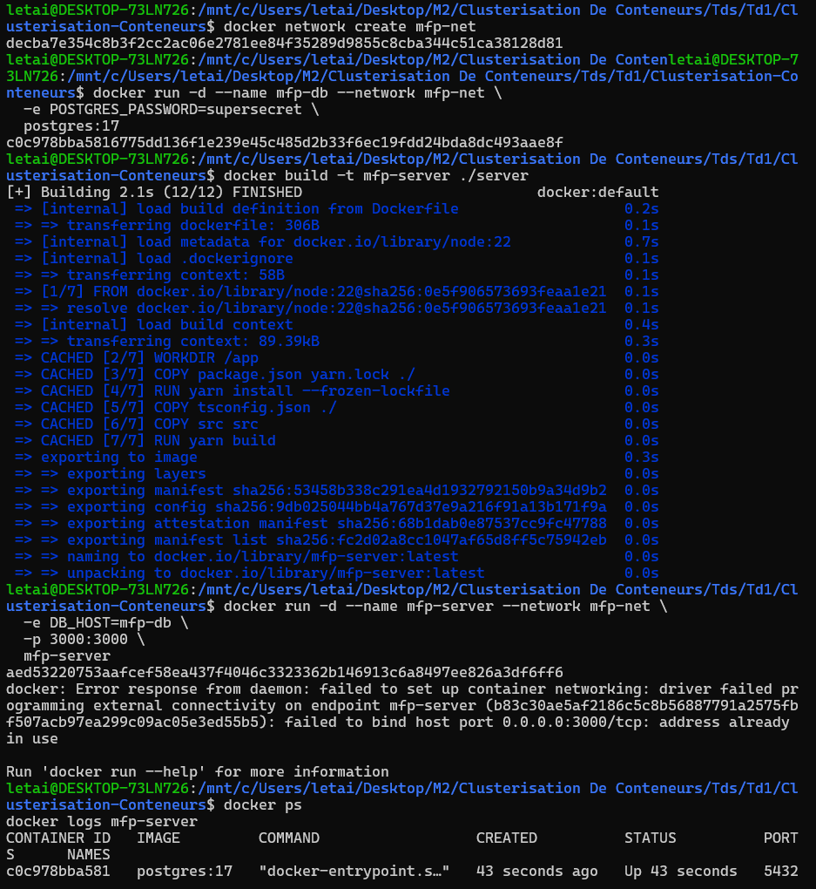

> **Problème rencontré :** au premier lancement, `docker run` a échoué avec `address already in use` sur le port 3000.
> <br/>Le `yarn dev` de l'étape 1 tournait encore et occupait ce port.
> <br/>**Solution :** arrêter `yarn dev` (Ctrl+C), supprimer le conteneur raté avec `docker rm -f mfp-server`, puis relancer la commande 4.

`docker ps` doit afficher `mfp-db` et `mfp-server` avec le statut `Up`, et `docker logs mfp-server` doit afficher :

```
✅ connected to PgSQL db
🚀 server started on port 3000
```

Au démarrage, on voit aussi dans les logs le serveur créer les tables `user` et `address` dans la base neuve.

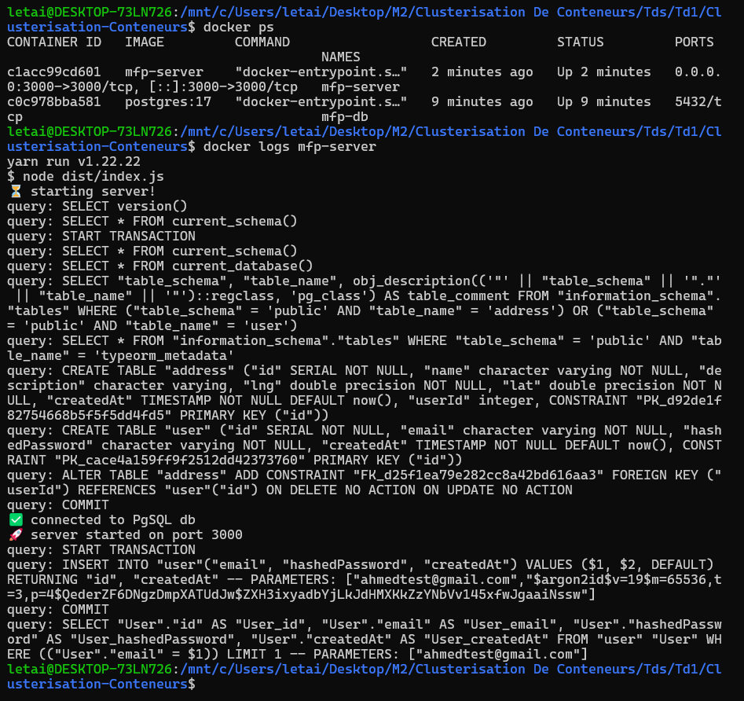

### 2.4 Test avec Bruno

Les requêtes de la collection restent les mêmes (`http://localhost:3000`) : avec `-p 3000:3000`, le conteneur répond à la même adresse que `yarn dev`.

La base est neuve, on exécute donc :

1. **01 - Create user** : crée l'utilisateur de test dans la nouvelle base.
2. **02 - Login (get token)** : renvoie `200` et un token.

La connexion réussit : le serveur, lancé dans Docker, lit bien l'utilisateur enregistré dans la base `mfp-db`.

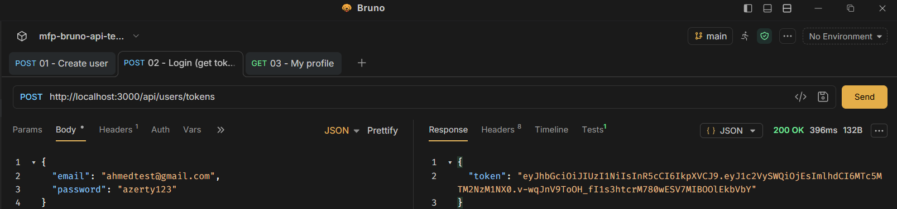

---

## 3. Dockerisation du client

**Objectif (TD1, étape 4) :** faire tourner le client React dans un conteneur, et vérifier qu'il communique avec le serveur.

### 3.1 Le Dockerfile du client

Fichier `client/Dockerfile` :

```dockerfile
FROM node:24-alpine3.24

WORKDIR /app

COPY package*.json yarn.lock ./
RUN yarn install --frozen-lockfile

COPY tsconfig*.json ./
COPY vite.config.ts ./
COPY index.html ./
COPY public public
COPY src src

EXPOSE 5173

CMD ["yarn", "dev", "--host"]
```

> Comme pour le serveur, les captures de cette étape ont été faites avec `node:22`, remplacée ensuite par `node:24-alpine3.24`.
> <br/>Ce Dockerfile a ensuite été remplacé par une version en 3 étapes, où le client est servi par **nginx** au lieu de Vite : voir [6.3](#63-alléger-les-images).

- Même principe que pour le serveur : les dépendances d'abord (mises en cache), puis uniquement les fichiers utiles.
- Le client est lancé avec le serveur de développement Vite, sur le port `5173`.
- `--host` : sans cette option, Vite n'accepte que les connexions venant de l'intérieur du conteneur, et le navigateur ne pourrait pas l'atteindre.

Le fichier `client/.dockerignore` exclut `node_modules` et `dist`.

### 3.2 Adapter l'adresse de l'API

Le client appelle l'API sur `/api/...`, et Vite redirige ces appels vers le serveur (fichier `client/vite.config.ts`). Cette adresse était `http://localhost:3000` : dans le conteneur du client, `localhost` désigne le client lui-même, comme pour le serveur à l'étape 2.

L'adresse est maintenant lue dans une variable d'environnement, avec l'ancienne valeur par défaut :

```ts
target: process.env.API_URL || "http://localhost:3000",
```

> Cette variable a ensuite été retirée : dans Docker, c'est maintenant nginx qui redirige les appels `/api` vers le serveur (voir [6.3](#63-alléger-les-images)). Dans `vite.config.ts`, l'adresse est maintenant `http://server:3000` : comme pour la base (`db`), le serveur est désigné par le nom de son service Compose.

### 3.3 Lancer le client

La base et le serveur de l'étape 2 doivent être lancés.

```bash
# 1. construire l'image du client
docker build -t mfp-client ./client

# 2. lancer le client sur le même réseau que le serveur
docker run -d --name mfp-client --network mfp-net \
  -e API_URL=http://mfp-server:3000 \
  -p 5173:5173 \
  mfp-client

# 3. vérifier
docker ps
docker logs mfp-client
```

- `-e API_URL=http://mfp-server:3000` : Vite redirige les appels `/api` vers le conteneur du serveur, par son nom.
- `-p 5173:5173` : rend le client accessible sur `http://localhost:5173`.

`docker ps` doit afficher les 3 conteneurs (`mfp-db`, `mfp-server`, `mfp-client`) avec le statut `Up`.

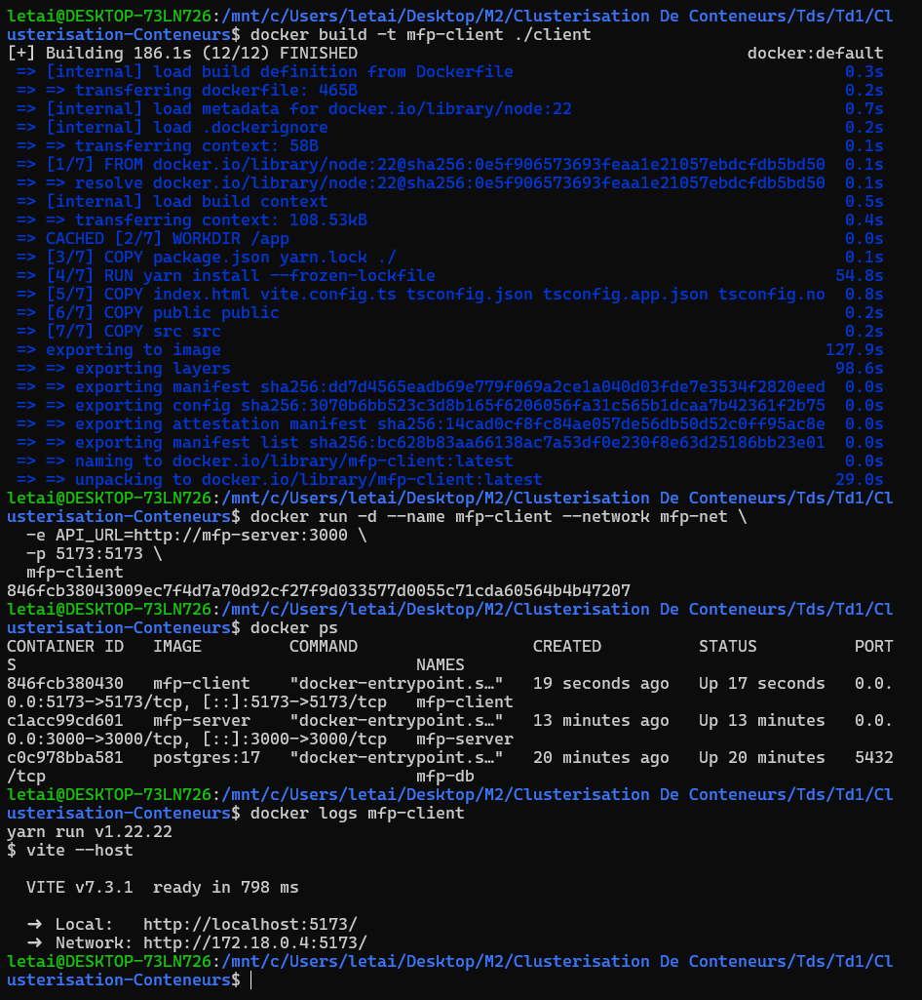

### 3.4 Test dans le navigateur

On ouvre `http://localhost:5173`, puis on se connecte avec l'utilisateur de test (`ahmedtest@gmail.com` / `azerty123`).

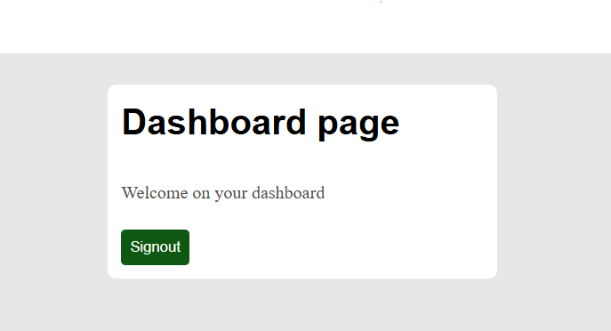

---

## 4. Orchestration avec Docker Compose

**Objectif (TD1, étape 3) :** remplacer toutes les commandes `docker network` et `docker run` des étapes 2 et 3 par un seul fichier, et lancer toute l'application avec une seule commande.

### 4.1 Le fichier `compose.yml`

Le fichier `compose.yml` se trouve à la racine du dépôt. Chaque bloc de `services` remplace une commande `docker run` :

| Service | Remplace | Points clés |
|---|---|---|
| `db` | `docker run ... postgres:17` | même utilisateur (`POSTGRES_USER`) et mot de passe que ceux attendus par le serveur ; port `5432` publié sur la machine |
| `server` | `docker build` + `docker run ... mfp-server` | joint la base par le **nom du service** `db` (voir [4.4](#44-simplification-de-la-connexion-à-la-base)) |
| `client` | `docker build` + `docker run ... mfp-client` | port `5173` publié ; les appels `/api` sont transmis au service `server` (voir [5](#5-communication-entre-les-services)) |

- **Réseau :** plus besoin de `docker network create`. Compose crée automatiquement un réseau commun à tous les services, et chaque service y est joignable par son nom (`db`, `server`, `client`).
- **Volume `db-data` :** les données de la base sont stockées dans un volume Docker. Elles sont conservées même si le conteneur `db` est supprimé et recréé.
- **`depends_on` :** Compose démarre les services dans l'ordre `db` → `server` → `client`.
- **`healthcheck` sur `db` :** toutes les 2 secondes, Docker lance `pg_isready` dans le conteneur pour savoir si PostgreSQL accepte les connexions. Le serveur, avec `condition: service_healthy`, attend que la base soit **prête** avant de démarrer.

### 4.2 Lancer l'application

On supprime d'abord les conteneurs et le réseau créés à la main aux étapes 2 et 3 (sinon les ports 3000 et 5173 sont déjà occupés) :

```bash
docker rm -f mfp-client mfp-server mfp-db
docker network rm mfp-net
```

Puis on lance tout avec Compose :

```bash
docker compose up -d --build
docker compose ps
docker compose logs server
```

- `up` : crée le réseau, le volume et les 3 conteneurs, puis les démarre.
- `-d` : en arrière-plan.
- `--build` : construit (ou reconstruit) les images du serveur et du client.

> **Problème rencontré :** au premier essai, avec un simple `depends_on: - db`, le serveur s'arrêtait aussitôt avec `unable to connect to db: connect ECONNREFUSED`.
> <br/>`depends_on` attend seulement que le conteneur de la base soit **démarré**, pas que PostgreSQL soit **prêt** : le serveur essayait de se connecter trop tôt.
> <br/>**Solution :** ajouter le `healthcheck` sur `db` et `condition: service_healthy` sur `server` (voir 4.1). On voit alors `mfp-db-1 Waiting` puis `Healthy` avant que le serveur démarre.

`docker compose ps` doit afficher les 3 services avec le statut `Up` (et `healthy` pour `db`), et les logs du serveur doivent afficher `connected to PgSQL db` puis `server started on port 3000`.

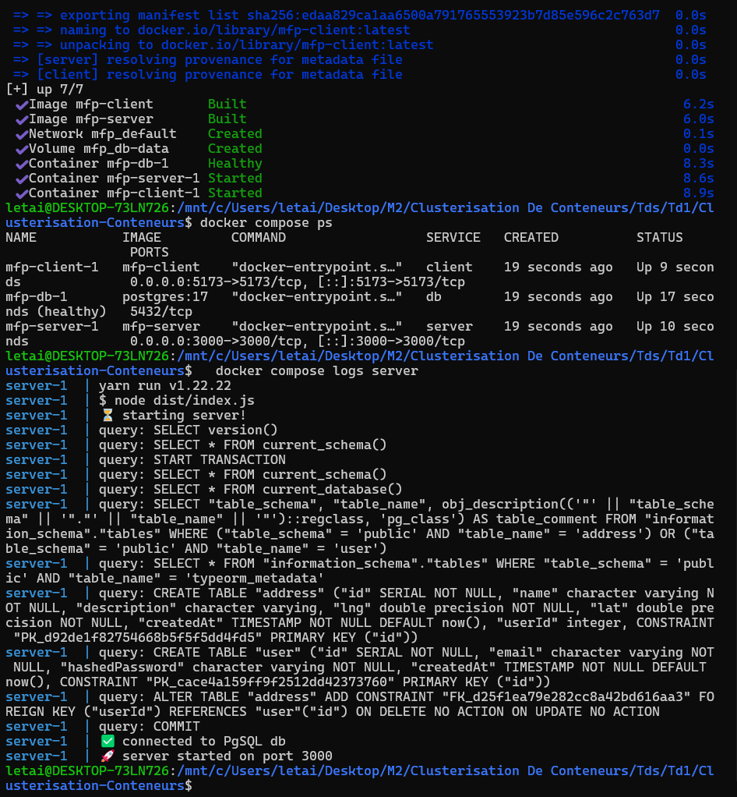

### 4.3 Test

La base est neuve (nouveau volume) : on crée l'utilisateur avec Bruno (**01 - Create user**), puis on se connecte dans le navigateur sur `http://localhost:5173` avec `ahmedtest@gmail.com` / `azerty123`.

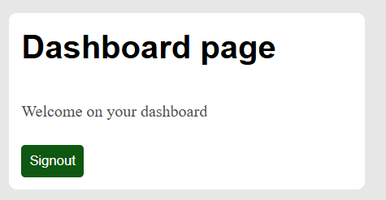

Pour tout arrêter : `docker compose down` (le volume `db-data` est conservé, les données aussi).

### 4.4 Simplification de la connexion à la base

Avec Compose, la base s'appelle toujours `db` : c'est le nom de son service. Les variables d'environnement de l'étape 2 ne sont donc plus nécessaires, et l'adresse de la base est écrite directement dans `server/src/datasource.ts` :

```ts
host: "db",
username: "postgres",
password: "supersecret",
database: "postgres",
```

Conséquence : le serveur ne fonctionne plus que **dans Compose**, là où le nom `db` existe. Les commandes manuelles de l'étape 2 (base nommée `mfp-db`) et le `yarn dev` de l'étape 1 (base sur `localhost`) ne peuvent plus se connecter à la base telles quelles.

---

## 5. Communication entre les services

**Question (TD1, étape 5) :** comment communiquent la base et le serveur ? Et le serveur et le front ?

```
 Machine (Windows / WSL)                 Réseau Docker « mfp_default »
 ┌──────────────────────┐              ┌───────────────────────────────────────────────┐
 │ Navigateur ──────────┼─ :5173 ─────►│ client (nginx) ── /api ──► server ──► db       │
 │                      │              │                           :3000      :5432    │
 │ Bruno ───────────────┼─ :3000 ─────►│                           server              │
 └──────────────────────┘              └───────────────────────────────────────────────┘
```

**Base ↔ serveur**
- Les deux conteneurs sont sur le même réseau, créé par Compose.
- Le serveur joint la base par le **nom du service** `db`, sur le port `5432` de PostgreSQL. Docker traduit ce nom en adresse du conteneur.
- La base n'a pas besoin d'être visible depuis la machine pour que le serveur lui parle. Le port `5432` est publié uniquement pour pouvoir s'y connecter depuis la machine si besoin.

**Front ↔ serveur**
- Le code React tourne **dans le navigateur**, donc sur la machine, en dehors du réseau Docker : il ne connaît pas le nom `server`.
- Le navigateur appelle donc l'API sur la même adresse que le site, `http://localhost:5173/api/...`.
- C'est le conteneur `client` qui transmet ces appels `/api` au service `server`, par le réseau Docker (d'abord avec Vite, puis avec nginx).
- Bruno, lui, appelle directement le serveur sur `http://localhost:3000`, grâce au port `3000` publié.

---

## 6. Démarrage, redémarrage et images légères

**Objectif (TD2) :** fiabiliser le démarrage, redémarrer automatiquement les services et alléger les images Docker.

### 6.1 Démarrer le serveur seulement quand la base est prête

Déjà fait à l'étape 4 : le `healthcheck` sur `db` et `condition: service_healthy` sur `server` (voir [4.1](#41-le-fichier-composeyml) et le problème rencontré en [4.2](#42-lancer-lapplication)).

### 6.2 Redémarrage automatique

Dans `compose.yml`, chaque service a maintenant :

```yaml
restart: unless-stopped
```

- Si un service s'arrête tout seul (plantage), Docker le **redémarre automatiquement**.
- Si on l'arrête **à la main** (`docker compose stop`), il reste arrêté.

Test : on simule un plantage du serveur en arrêtant son processus Node, puis on regarde combien de fois Docker l'a redémarré.

```bash
docker compose exec server pkill -f "node dist/index.js"
docker inspect mfp-server-1 --format 'status={{.State.Status}} restarts={{.RestartCount}}'
# status=running restarts=1

docker compose stop server
docker inspect mfp-server-1 --format 'status={{.State.Status}} restarts={{.RestartCount}}'
# status=exited restarts=1   (arrêt manuel : pas de redémarrage)

docker compose start server
```
### 6.3 Alléger les images

Les Dockerfiles sont découpés en **3 étapes** (*multi-stage build*). Seule la dernière étape devient l'image finale : tout ce qui sert uniquement à construire l'application (outils de compilation, dépendances de développement, code source TypeScript) reste dans les étapes intermédiaires.

| Étape | Rôle |
|---|---|
| `deps` | installe toutes les dépendances |
| `builder` | construit l'application (`yarn build`) |
| `main` | image finale : seulement ce qui est utile pour lancer l'application |

**Serveur** (`server/Dockerfile`) : l'image finale contient le JavaScript compilé (`dist`) et uniquement les dépendances de production (`--production`).

**Client** (`client/Dockerfile`) : `yarn build` transforme l'application React en simples fichiers HTML, CSS et JavaScript. L'image finale n'a plus besoin de Node.js : un serveur web **nginx** suffit pour envoyer ces fichiers au navigateur.

La configuration de nginx est dans le fichier `client/nginx.conf`, copié dans l'image :

```nginx
server {
    listen 5173;
    root /usr/share/nginx/html;

    location / {
        try_files $uri $uri/ /index.html;
    }

    location /api/ {
        proxy_pass http://server:3000;
    }
}
```

- `listen 5173` : nginx écoute sur le même port qu'avant, l'adresse du site ne change pas (`http://localhost:5173`).
- `location /` : envoie les fichiers du site. Pour une page comme `/dashboard`, qui n'existe pas en tant que fichier, nginx renvoie `index.html` et React affiche la bonne page.
- `location /api/` : transmet les appels à l'API au service `server`. C'est ce qui remplace le proxy de Vite.

**Résultat :**

| Image | Avant | Après |
|---|---|---|
| `mfp-server` | 477 Mo | **337 Mo** (−140 Mo) |
| `mfp-client` | 1,49 Go | **93 Mo** |

```bash
docker compose up -d --build
docker images
```

# TD2
